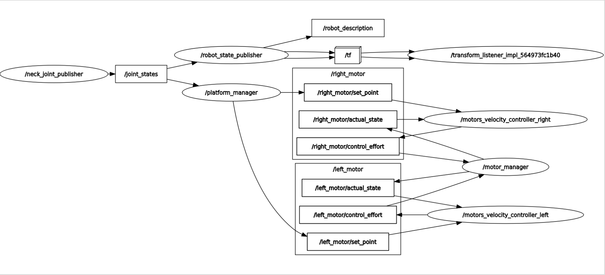
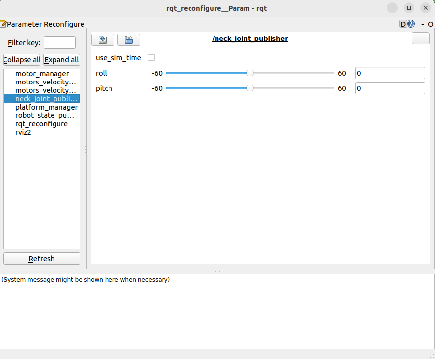
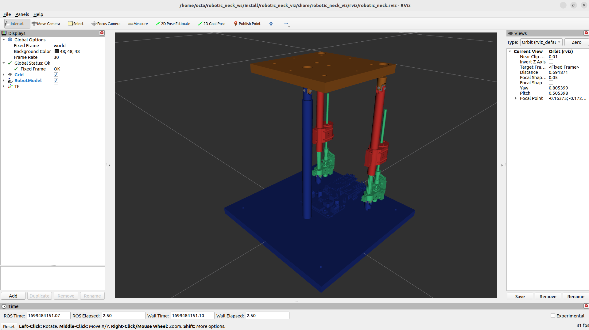

# robotic_neck_control
 ROS2 package to apply PID position control over the linear actuators for pitch and roll manipulation.

 ## Ros2 Robotic Neck Control Graph
 At the moment, this version works sending linear travel to each linear actuator. 

 

## Dependencies
* Framework: [ROS2 Humble (desktop)](https://docs.ros.org/en/humble/Installation/Ubuntu-Install-Debians.html)
* [launch_utils](https://github.com/MonkyDCristian/launch_utils)

## Install and Compile
**Note:** Install [launch_utils](https://github.com/MonkyDCristian/launch_utils) in your workspace before follow this step
```
cd <path to your workspace src>/
git clone https://github.com/Robotic-Neck/robotic_neck_control.git
cd ..
colcon build --packages-select pid_library
source ~/.bashrc
colcon build --packages-select motors_velocity_controller
source ~/.bashrc
colcon build
```

## Install ROS packages dependencies with rosdep  
```
cd <path to your workspace src>/
rosdep install -i --from-path src --rosdistro humble -y
```

## Demo

Run the controller:
```
ros2 launch platform_controller platform_controller.launch.py
```

You should see the visualization in RVIZ2 and the rqt_reconfigure interface. Here you can change the pitch and roll values.

 


The visualization should look like:



## Documentation


