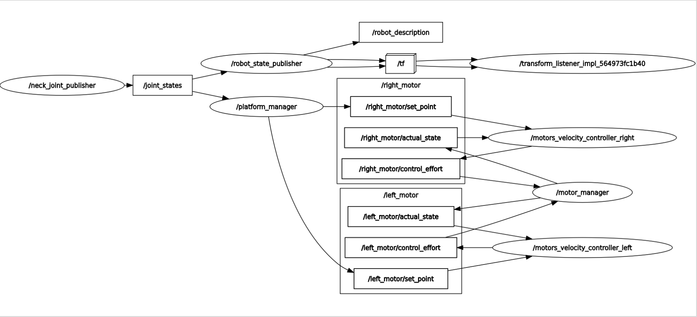

# robotic_neck_control
 ROS2 package to apply PID position control over the linear actuators for pitch and roll manipulation.

 ## Ros2 Robotic Neck Control Graph
 At the moment, this version works sending linear travel to each linear actuator. 

 

## Dependencies
* Framework: [ROS2 Humble (desktop)](https://docs.ros.org/en/humble/Installation/Ubuntu-Install-Debians.html)
* [launch_utils](https://github.com/MonkyDCristian/launch_utils)

## Install and Compile
**Note:** Install [launch_utils](https://github.com/MonkyDCristian/launch_utils) in your workspace before follow this step
```
cd <path to your workspace src>/
git clone https://github.com/Robotic-Neck/robotic_neck_control.git
cd ..
colcon build --packages-select robotic_neck_control
```

## Install ROS packages dependencies with rosdep  
```
cd <path to your workspace src>/
rosdep install -i --from-path src --rosdistro humble -y
```

## Demo

Run the controller:
```
ros2 launch platform_controller platform_controller.launch.py
```

In another terminal send linear travel to both linear actuators:
```
ros2 topic pub --once /platform/right_lineal_actuator_travel std_msgs/msg/Float32 "data: 30.0" & ros2 topic pub --once /platform/left_lineal_actuator_travel std_msgs/msg/Float32 "data: 30.0"
```

Note: Distance is in mm. Positive distance means going down and negative distance means going up.

## Documentation


